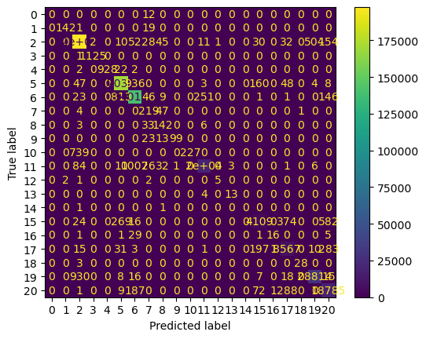
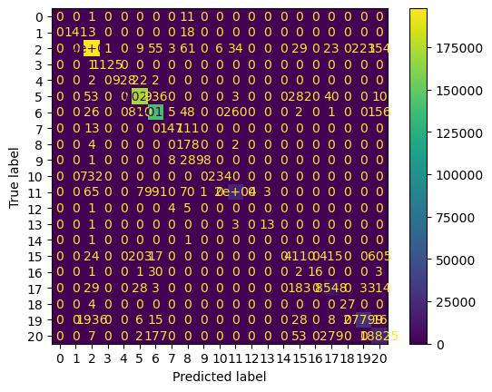
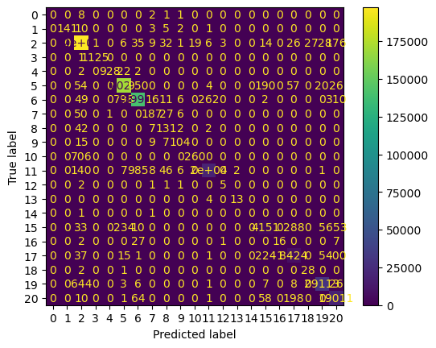

# 목차

- 1089999 병합 레코드의 테스트
    - Merge
    - BM
    - SM
- 3M 병합 레코드의 테스트 결과 
    - Merge
    - BM
    - SM


# 테스트 환경 설명
---
- 레이어별 node 설정과 dropout 설정

|Model|Input|Dropout|Hidden1|Dropout|Hidden2|Dropout|Output|
|:---|:---|:---|:---|:---|:---|:---|:---|
|Model1|64|-|128|0.3|128|0.3|64| 
|Model2|64|0.3|128|0.2|256|0.1|128| 
|Model3|512|0.1|256|0.3|128|0.2|128| 
|Model4|128|0.3|64|0.1|64|0.1|128| 
|ModelB|256|-|128|0.3|128|0.3|64| 
|ModelS|256|0.3|128|0.2|128|0.1|64| 


---

# 3M 병합 레코드의 테스트

- 각 모델의 학습 결과

|Model|loss|accuracy|val_loss|val_acc|
|:---|:---|:---|:---|:---|
|Model1|0.0600|0.9839|0.0568|0.9848|
|Model2|0.0617|0.9836|0.0570|0.9848|
|Model3|0.0611|0.9838|0.0592|0.9846|
|Model4|0.0679|0.9817|0.0593|0.9841|
|ModelB|0.0012|0.9998|0.1074|0.9994|
|ModelS|0.1004|0.9689|0.0792|0.9794|


- 테스트 정리

|Model|loss|accuracy|test acc|
|:---|:---|:---|:---|
|Merge7|0.0593|0.9850|0.9852|
|Merge60|0.0689|0.9845|0.9803|
|BM7|0.0586|0.9852|0.9853|
|BM60|0.0693|0.9846|0.9838|
|SM7|0.0573|0.9853|0.9854|
|SM60|0.0699|0.9847|0.9851|

```

``` 

## Merge


|Model|loss|accuracy|val_loss|val_acc|
|:---|:---|:---|:---|:---|
|Model1|0.0600|0.9839|0.0568|0.9848|
|Model2|0.0617|0.9836|0.0570|0.9848|
|Model3|0.0611|0.9838|0.0592|0.9846|
|Model4|0.0679|0.9817|0.0593|0.9841|
 
- Ensemble 모델 학습 결과

|Model|loss|accuracy|test acc|
|:---|:---|:---|:---|
|Merge7|0.0593|0.9850|0.9852|
|Merge60|0.0689|0.9845|0.9803|

```
              precision    recall  f1-score   support

           0       0.00      0.00      0.00        12
           1       0.99      0.88      0.93       162
           2       0.99      1.00      0.99    198477
           3       1.00      1.00      1.00      1126
           4       1.00      0.97      0.99       954
           5       0.99      0.99      0.99    171544
           6       0.98      0.99      0.99    141449
           7       0.54      0.81      0.65       271
           8       0.49      0.77      0.60       184
           9       0.99      0.73      0.84       135
          10       1.00      0.23      0.38       966
          11       0.99      0.94      0.96     20974
          12       0.83      0.50      0.62        10
          13       0.81      0.76      0.79        17
          14       0.00      0.00      0.00         2
          15       0.90      0.76      0.83      5374
          16       0.89      0.30      0.45        53
          17       0.92      0.94      0.93      9108
          18       0.97      0.90      0.93        31
          19       0.98      0.97      0.97     29808
          20       0.94      0.97      0.96     19343

    accuracy                           0.99    600000
   macro avg       0.82      0.73      0.75    600000
weighted avg       0.99      0.99      0.98    600000
```



### Merge epoch 60

```
           precision    recall  f1-score   support

           0       0.00      0.00      0.00        12
           1       1.00      0.87      0.93       162
           2       0.97      1.00      0.99    198477
           3       1.00      1.00      1.00      1126
           4       1.00      0.97      0.99       954
           5       0.99      0.99      0.99    171544
           6       0.99      0.99      0.99    141449
           7       0.42      0.92      0.58       271
           8       0.45      0.21      0.28       184
           9       0.99      0.73      0.84       135
          10       1.00      0.24      0.38       966
          11       0.98      0.94      0.96     20974
          12       0.67      0.40      0.50        10
          13       0.73      0.94      0.82        17
          14       0.00      0.00      0.00         2
          15       0.89      0.77      0.82      5374
          16       1.00      0.30      0.46        53
          17       0.98      0.82      0.89      9108
          18       1.00      0.84      0.91        31
          19       0.99      0.94      0.96     29808
          20       0.90      0.99      0.95     19343

    accuracy                           0.98    600000
   macro avg       0.81      0.71      0.73    600000
weighted avg       0.98      0.98      0.98    600000
```


## BM

- 각 모델의 학습 결과

|Model|loss|accuracy|val_loss|val_acc|
|:---|:---|:---|:---|:---|
|Model1|0.0600|0.9839|0.0568|0.9848|
|Model2|0.0617|0.9836|0.0570|0.9848|
|Model3|0.0611|0.9838|0.0592|0.9846|
|ModelB|0.0012|0.9998|0.1074|0.9994|


- 테스트 정리

|Model|loss|accuracy|test acc|
|:---|:---|:---|:---|
|BM7|0.0586|0.9852|0.0.9853|
|BM60|0.0693|0.9846|0.9838|

### BM epoch 7

```
             precision    recall  f1-score   support

           0       1.00      0.08      0.15        12
           1       0.99      0.88      0.93       162
           2       0.99      0.99      0.99    198477
           3       1.00      1.00      1.00      1126
           4       1.00      0.97      0.99       954
           5       0.99      0.99      0.99    171544
           6       0.98      0.99      0.99    141449
           7       0.77      0.55      0.64       271
           8       0.52      0.53      0.53       184
           9       0.58      0.77      0.66       135
          10       0.99      0.24      0.39       966
          11       0.98      0.95      0.96     20974
          12       1.00      0.30      0.46        10
          13       0.92      0.65      0.76        17
          14       0.00      0.00      0.00         2
          15       0.90      0.77      0.83      5374
          16       0.89      0.32      0.47        53
          17       0.93      0.93      0.93      9108
          18       1.00      0.90      0.95        31
          19       0.97      0.98      0.98     29808
          20       0.94      0.97      0.95     19343

    accuracy                           0.99    600000
   macro avg       0.87      0.70      0.74    600000
weighted avg       0.99      0.99      0.98    600000
```


### BM epoch 60

```
            precision    recall  f1-score   support

           0       0.00      0.00      0.00        12
           1       1.00      0.87      0.93       162
           2       0.99      1.00      0.99    198477
           3       1.00      1.00      1.00      1126
           4       1.00      0.97      0.99       954
           5       0.99      0.99      0.99    171544
           6       0.98      0.99      0.99    141449
           7       0.88      0.54      0.67       271
           8       0.34      0.97      0.50       184
           9       0.99      0.73      0.84       135
          10       0.97      0.24      0.39       966
          11       0.99      0.95      0.96     20974
          12       0.00      0.00      0.00        10
          13       0.81      0.76      0.79        17
          14       0.00      0.00      0.00         2
          15       0.88      0.76      0.82      5374
          16       1.00      0.30      0.46        53
          17       0.92      0.94      0.93      9108
          18       1.00      0.87      0.93        31
          19       0.99      0.93      0.96     29808
          20       0.94      0.97      0.95     19343

    accuracy                           0.98    600000
   macro avg       0.79      0.70      0.72    600000
weighted avg       0.98      0.98      0.98    600000
```



## SM
- 각 모델의 학습 결과

|Model|loss|accuracy|val_loss|val_acc|
|:---|:---|:---|:---|:---|
|Model1|0.0600|0.9839|0.0568|0.9848|
|Model2|0.0617|0.9836|0.0570|0.9848|
|Model3|0.0611|0.9838|0.0592|0.9846|
|ModelS|0.1004|0.9689|0.0792|0.9794|


- 테스트 정리

|Model|loss|accuracy|test acc|
|:---|:---|:---|:---|
|SM7|0.0573|0.9853|0.0.9854|
|SM60|0.0699|0.9847|0.0.9851|

### SM epoch 7

              precision    recall  f1-score   support

           0       0.21      0.25      0.23        12
           1       0.99      0.88      0.93       162
           2       0.99      0.99      0.99    198477
           3       1.00      1.00      1.00      1126
           4       1.00      0.97      0.99       954
           5       0.99      0.99      0.99    171544
           6       0.98      0.99      0.99    141449
           7       0.68      0.77      0.72       271
           8       0.49      0.74      0.59       184
           9       0.78      0.77      0.77       135
          10       0.98      0.24      0.39       966
          11       0.98      0.95      0.96     20974
          12       0.57      0.40      0.47        10
          13       0.85      1.00      0.92        17
          14       0.00      0.00      0.00         2
          15       0.86      0.80      0.83      5374
          16       0.82      0.34      0.48        53
          17       0.94      0.92      0.93      9108
          18       0.93      0.90      0.92        31
          19       0.97      0.98      0.98     29808
          20       0.94      0.97      0.96     19343

    accuracy                           0.99    600000
   macro avg       0.81      0.76      0.76    600000
weighted avg       0.99      0.99      0.98    600000


### SM epoch 60


```
          precision    recall  f1-score   support

           0       0.00      0.00      0.00        12
           1       1.00      0.87      0.93       162
           2       0.99      0.99      0.99    198477
           3       1.00      1.00      1.00      1126
           4       1.00      0.97      0.99       954
           5       0.99      0.99      0.99    171544
           6       0.99      0.99      0.99    141449
           7       0.77      0.69      0.73       271
           8       0.50      0.71      0.59       184
           9       0.81      0.77      0.79       135
          10       0.93      0.27      0.42       966
          11       0.99      0.94      0.96     20974
          12       0.56      0.50      0.53        10
          13       0.87      0.76      0.81        17
          14       0.00      0.00      0.00         2
          15       0.89      0.77      0.83      5374
          16       0.94      0.30      0.46        53
          17       0.94      0.92      0.93      9108
          18       0.93      0.90      0.92        31
          19       0.97      0.98      0.98     29808
          20       0.92      0.98      0.95     19343

    accuracy                           0.99    600000
   macro avg       0.81      0.73      0.75    600000
weighted avg       0.99      0.99      0.98    600000
```


